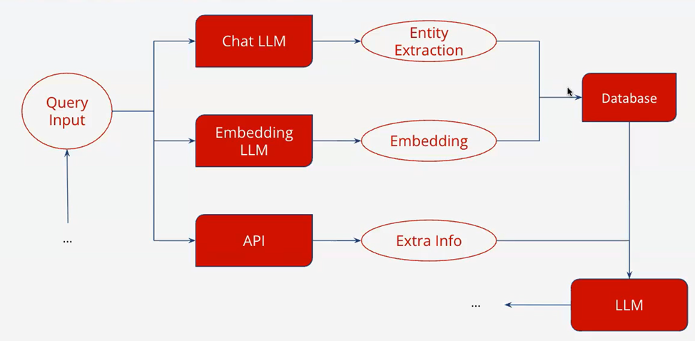

# RAG and Reasoning Frameworks: Complete Tutorial

## Table of Contents
1. [Introduction](#introduction)
2. [RAG Fundamentals](#rag-fundamentals)
3. [Vector Databases and Storage](#vector-databases-and-storage)
4. [Chunking Strategies](#chunking-strategies)
5. [Reasoning Frameworks](#reasoning-frameworks)
6. [Advanced Techniques](#advanced-techniques)
7. [Tool Ecosystem](#tool-ecosystem)
8. [Implementation Guide](#implementation-guide)
9. [Evaluation Methods](#evaluation-methods)
10. [Summary](#summary-table)


## Introduction

Retrieval Augmented Generation (RAG) has emerged as a foundational architecture for building intelligent information systems that can access and reason over large knowledge bases. While basic RAG provides document retrieval and generation capabilities, advanced reasoning frameworks enable sophisticated question-answering, decision-making, and logical inference.

This tutorial covers the complete spectrum from basic RAG implementation to advanced reasoning capabilities, providing teams with the knowledge needed to build production-ready knowledge-based AI systems.

## RAG Fundamentals

### Core Concepts

**Retrieval Augmented Generation (RAG)** combines the strengths of retrieval-based and generation-based approaches:

- **Retrieval**: Finding relevant information from a knowledge base
- **Augmentation**: Enhancing prompts with retrieved context
- **Generation**: Producing responses using augmented context

### Basic RAG Architecture



---

###  **Luồng xử lý tổng quát:**

1. **Query Input (Truy vấn đầu vào)**

   * Người dùng gửi truy vấn.

2. **Song song các quá trình:**

   * **Chat LLM**:
     → Trích xuất thực thể (Entity Extraction) từ truy vấn.
     → Kết quả này lưu vào **Database**.

   * **Embedding LLM**:
     → Biến truy vấn thành vector (Embedding).
     → Kết quả cũng được lưu vào **Database** để phục vụ cho tìm kiếm vector (Vector Search).

   * **API**:
     → Gọi tới dịch vụ bên ngoài để lấy thông tin bổ sung (Extra Info).
     → Dữ liệu này cũng được đẩy vào **Database**.

3. **Database (Kho lưu trữ trung gian):**

   * Tập hợp: Entity, Embedding, Extra Info từ các bước trên.
   * Các dữ liệu này phục vụ để tăng cường truy vấn (Augmented Prompt).

4. **LLM chính:**

   * Nhận đầu vào là prompt đã được tăng cường từ thông tin trong Database.
   * Sinh ra phản hồi cuối cùng cho người dùng.


#### Key Components:

1. **Document Ingestion Pipeline**
   - Document parsing and preprocessing
   - Text chunking and segmentation
   - Embedding generation
   - Vector storage

2. **Retrieval Pipeline**
   - Query embedding
   - Similarity search
   - Ranking and filtering
   - Context selection

3. **Generation Pipeline**
   - Prompt construction
   - Context augmentation
   - LLM inference
   - Response post-processing

### Implementation Patterns

#### 1. Naive RAG
```python
def naive_rag(query, vector_db, llm):
    # Retrieve relevant documents
    docs = vector_db.similarity_search(query, k=5)
    
    # Augment prompt with context
    context = "\n".join([doc.content for doc in docs])
    prompt = f"Context: {context}\n\nQuestion: {query}\n\nAnswer:"
    
    # Generate response
    response = llm.generate(prompt)
    return response
```

#### 2. Advanced RAG
```python
def advanced_rag(query, vector_db, llm, reranker=None):
    # Multi-stage retrieval
    initial_docs = vector_db.similarity_search(query, k=20)
    
    # Reranking (optional)
    if reranker:
        ranked_docs = reranker.rank(query, initial_docs)
        final_docs = ranked_docs[:5]
    else:
        final_docs = initial_docs[:5]
    
    # Context filtering and organization
    context = organize_context(final_docs)
    
    # Structured prompt construction
    prompt = build_structured_prompt(query, context)
    
    # Generate with metadata
    response = llm.generate(prompt)
    return response, final_docs
```

## Vector Databases and Storage

### Vector Database Comparison

| Database | Strengths | Use Cases | Scaling |
|----------|-----------|-----------|---------|
| **Pinecone** | Managed service, high performance | Production RAG systems | Excellent |
| **Weaviate** | GraphQL interface, hybrid search | Complex queries | Good |
| **Chroma** | Lightweight, easy setup | Development/prototyping | Limited |
| **Qdrant** | High performance, filtering | Large-scale deployments | Excellent |
| **Milvus** | Open source, distributed | Enterprise deployments | Excellent |

### Storage Strategies

#### 1. Flat Storage
```python
# Simple document storage
documents = [
    {"id": "doc1", "content": "...", "metadata": {...}},
    {"id": "doc2", "content": "...", "metadata": {...}}
]
```

#### 2. Hierarchical Storage
```python
# Organized by document structure
storage = {
    "documents": {
        "doc1": {
            "title": "...",
            "sections": [
                {"id": "sec1", "content": "...", "embedding": [...]},
                {"id": "sec2", "content": "...", "embedding": [...]}
            ]
        }
    }
}
```

#### 3. Graph-Based Storage
```python
# Relationships between chunks
graph = {
    "nodes": [
        {"id": "chunk1", "content": "...", "type": "paragraph"},
        {"id": "chunk2", "content": "...", "type": "table"}
    ],
    "edges": [
        {"from": "chunk1", "to": "chunk2", "relation": "references"}
    ]
}
```

## Chunking Strategies

### Text Chunking Approaches

#### 1. Fixed-Size Chunking
```python
def fixed_size_chunking(text, chunk_size=512, overlap=50):
    chunks = []
    for i in range(0, len(text), chunk_size - overlap):
        chunk = text[i:i + chunk_size]
        chunks.append(chunk)
    return chunks
```

#### 2. Semantic Chunking
```python
def semantic_chunking(text, model, similarity_threshold=0.7):
    sentences = split_into_sentences(text)
    embeddings = model.encode(sentences)
    
    chunks = []
    current_chunk = [sentences[0]]
    
    for i in range(1, len(sentences)):
        similarity = cosine_similarity(embeddings[i-1], embeddings[i])
        
        if similarity > similarity_threshold:
            current_chunk.append(sentences[i])
        else:
            chunks.append(" ".join(current_chunk))
            current_chunk = [sentences[i]]
    
    if current_chunk:
        chunks.append(" ".join(current_chunk))
    
    return chunks
```

#### 3. Document-Aware Chunking
```python
def document_aware_chunking(document):
    chunks = []
    
    # Respect document structure
    for section in document.sections:
        section_chunks = []
        
        for paragraph in section.paragraphs:
            if len(paragraph) > MAX_CHUNK_SIZE:
                # Split long paragraphs
                para_chunks = split_paragraph(paragraph)
                section_chunks.extend(para_chunks)
            else:
                section_chunks.append(paragraph)
        
        # Combine small chunks within sections
        combined_chunks = combine_small_chunks(section_chunks)
        chunks.extend(combined_chunks)
    
    return chunks
```
## Reasoning Frameworks

### Chain-of-Thought (CoT) Reasoning

#### Basic CoT
```python
def chain_of_thought_rag(query, vector_db, llm):
    # Retrieve relevant documents
    docs = vector_db.similarity_search(query, k=5)
    context = "\n".join([doc.content for doc in docs])
    
    # CoT prompt
    prompt = f"""
    Context: {context}
    
    Question: {query}
    
    Let's think through this step by step:
    1. What information do I need to answer this question?
    2. What relevant information is available in the context?
    3. How can I reason through this information?
    4. What is my final answer?
    
    Answer:
    """
    
    response = llm.generate(prompt)
    return response
```

#### Self-Consistency CoT
```python
def self_consistency_cot(query, vector_db, llm, num_samples=5):
    responses = []
    
    for _ in range(num_samples):
        response = chain_of_thought_rag(query, vector_db, llm)
        responses.append(response)
    
    # Extract final answers
    answers = [extract_final_answer(resp) for resp in responses]
    
    # Vote for most common answer
    final_answer = majority_vote(answers)
    return final_answer, responses
```

### Tree-of-Thought (ToT) Reasoning

```python
class TreeOfThought:
    def __init__(self, llm, vector_db):
        self.llm = llm
        self.vector_db = vector_db
    
    def solve(self, query, max_depth=3):
        # Initial thought generation
        initial_thoughts = self.generate_thoughts(query, depth=0)
        
        # Build reasoning tree
        tree = self.build_tree(initial_thoughts, query, max_depth)
        
        # Select best path
        best_path = self.select_best_path(tree)
        
        # Generate final answer
        final_answer = self.generate_final_answer(best_path, query)
        
        return final_answer, tree
    
    def generate_thoughts(self, query, depth, parent_thought=None):
        # Retrieve relevant context
        context = self.get_context(query, parent_thought)
        
        # Generate multiple reasoning paths
        prompt = f"""
        Context: {context}
        Query: {query}
        Current reasoning: {parent_thought or "None"}
        
        Generate 3 different ways to approach this problem:
        """
        
        thoughts = self.llm.generate(prompt, num_responses=3)
        return thoughts
```

### ReAct Framework

```python
class ReActAgent:
    def __init__(self, llm, tools):
        self.llm = llm
        self.tools = tools
    
    def solve(self, query, max_steps=10):
        trajectory = []
        
        for step in range(max_steps):
            # Reasoning step
            thought = self.think(query, trajectory)
            trajectory.append(("Thought", thought))
            
            # Action step
            action = self.act(thought, trajectory)
            trajectory.append(("Action", action))
            
            # Observation step
            observation = self.observe(action)
            trajectory.append(("Observation", observation))
            
            # Check if done
            if self.is_complete(observation):
                break
        
        # Generate final answer
        final_answer = self.generate_answer(query, trajectory)
        return final_answer, trajectory
    
    def think(self, query, trajectory):
        prompt = f"""
        Question: {query}
        
        Previous steps:
        {self.format_trajectory(trajectory)}
        
        What should I think about next?
        """
        return self.llm.generate(prompt)
    
    def act(self, thought, trajectory):
        available_tools = list(self.tools.keys())
        
        prompt = f"""
        Thought: {thought}
        
        Available tools: {available_tools}
        
        What action should I take? Format: Tool[input]
        """
        return self.llm.generate(prompt)
```

## Advanced Techniques

### Multi-Hop Reasoning

```python
class MultiHopRAG:
    def __init__(self, llm, vector_db):
        self.llm = llm
        self.vector_db = vector_db
    
    def multi_hop_query(self, query, max_hops=3):
        current_query = query
        all_evidence = []
        reasoning_chain = []
        
        for hop in range(max_hops):
            # Retrieve for current query
            docs = self.vector_db.similarity_search(current_query, k=5)
            all_evidence.extend(docs)
            
            # Analyze retrieved information
            analysis = self.analyze_evidence(docs, current_query)
            reasoning_chain.append(analysis)
            
            # Generate follow-up query
            next_query = self.generate_followup(current_query, analysis)
            
            if not next_query or self.is_sufficient(analysis):
                break
            
            current_query = next_query
        
        # Synthesize final answer
        final_answer = self.synthesize_answer(query, all_evidence, reasoning_chain)
        return final_answer, reasoning_chain
    
    def analyze_evidence(self, docs, query):
        context = "\n".join([doc.content for doc in docs])
        
        prompt = f"""
        Query: {query}
        Evidence: {context}
        
        Analyze this evidence:
        1. What questions does it answer?
        2. What questions remain unanswered?
        3. What additional information is needed?
        
        Analysis:
        """
        return self.llm.generate(prompt)
```

### Fact Verification

```python
class FactVerificationRAG:
    def __init__(self, llm, vector_db, fact_checker):
        self.llm = llm
        self.vector_db = vector_db
        self.fact_checker = fact_checker
    
    def verify_and_generate(self, query):
        # Initial RAG response
        initial_response = self.basic_rag(query)
        
        # Extract claims
        claims = self.extract_claims(initial_response)
        
        # Verify each claim
        verified_claims = []
        for claim in claims:
            verification = self.verify_claim(claim)
            verified_claims.append({
                "claim": claim,
                "verification": verification,
                "sources": verification.get("sources", [])
            })
        
        # Generate verified response
        verified_response = self.generate_verified_response(
            query, verified_claims
        )
        
        return verified_response, verified_claims
    
    def verify_claim(self, claim):
        # Search for supporting evidence
        evidence_docs = self.vector_db.similarity_search(claim, k=10)
        
        # Fact-check against evidence
        verification_result = self.fact_checker.check(claim, evidence_docs)
        
        return verification_result
```

### Source Attribution

```python
class AttributedRAG:
    def __init__(self, llm, vector_db):
        self.llm = llm
        self.vector_db = vector_db
    
    def generate_with_attribution(self, query):
        # Retrieve with metadata
        docs = self.vector_db.similarity_search(query, k=5)
        
        # Generate response with source tracking
        response = self.generate_attributed_response(query, docs)
        
        # Extract and validate attributions
        attributions = self.extract_attributions(response, docs)
        
        return response, attributions
    
    def generate_attributed_response(self, query, docs):
        # Create context with source markers
        context_parts = []
        for i, doc in enumerate(docs):
            context_parts.append(f"[Source {i+1}]: {doc.content}")
        
        context = "\n\n".join(context_parts)
        
        prompt = f"""
        Context:
        {context}
        
        Question: {query}
        
        Instructions:
        - Answer the question using the provided context
        - When making claims, cite sources using [Source X] format
        - Only use information from the provided sources
        
        Answer:
        """
        
        return self.llm.generate(prompt)
```

## Tool Ecosystem

### Framework Comparison

#### LangChain
```python
# LangChain RAG implementation
from langchain.chains import RetrievalQA
from langchain.vectorstores import Chroma
from langchain.llms import OpenAI

# Setup
vectorstore = Chroma.from_documents(documents, embeddings)
llm = OpenAI(temperature=0)

# Create RAG chain
qa_chain = RetrievalQA.from_chain_type(
    llm=llm,
    chain_type="stuff",
    retriever=vectorstore.as_retriever(),
    return_source_documents=True
)

# Query
result = qa_chain({"query": "What is the capital of France?"})
```

#### LlamaIndex
```python
# LlamaIndex RAG implementation
from llama_index import VectorStoreIndex, SimpleDirectoryReader
from llama_index.llms import OpenAI

# Setup
documents = SimpleDirectoryReader("./data").load_data()
llm = OpenAI(temperature=0)

# Create index
index = VectorStoreIndex.from_documents(documents)

# Create query engine
query_engine = index.as_query_engine(llm=llm)

# Query
response = query_engine.query("What is the capital of France?")
```

### Vector Database Integration

#### Pinecone Integration
```python
import pinecone
from langchain.vectorstores import Pinecone

# Initialize Pinecone
pinecone.init(api_key="your-api-key", environment="us-west1-gcp")

# Create index
index_name = "rag-index"
if index_name not in pinecone.list_indexes():
    pinecone.create_index(index_name, dimension=1536)

# Create vector store
vectorstore = Pinecone.from_documents(
    documents, embeddings, index_name=index_name
)
```

### Reasoning Tool Integration

#### ReAct with Tools
```python
from langchain.agents import initialize_agent, AgentType
from langchain.tools import Tool

# Define tools
def search_tool(query):
    return vector_db.similarity_search(query, k=5)

def calculator_tool(expression):
    return eval(expression)  # In production, use safe evaluation

tools = [
    Tool(
        name="Search",
        func=search_tool,
        description="Search the knowledge base for information"
    ),
    Tool(
        name="Calculator",
        func=calculator_tool,
        description="Perform mathematical calculations"
    )
]

# Create ReAct agent
agent = initialize_agent(
    tools, llm, agent=AgentType.ZERO_SHOT_REACT_DESCRIPTION, verbose=True
)

# Use agent
result = agent.run("What is the square root of the number of employees mentioned in the Q1 report?")
```

## Implementation Guide

###  Basic RAG System

```python
import os
from typing import List, Dict, Any
import numpy as np
from sentence_transformers import SentenceTransformer
import chromadb
from openai import OpenAI

class BasicRAGSystem:
    def __init__(self, model_name="all-MiniLM-L6-v2"):
        self.embedding_model = SentenceTransformer(model_name)
        self.client = chromadb.Client()
        self.collection = self.client.create_collection("documents")
        self.llm = OpenAI(api_key=os.getenv("OPENAI_API_KEY"))
    
    def add_documents(self, documents: List[str], metadatas: List[Dict] = None):
        """Add documents to the vector database"""
        embeddings = self.embedding_model.encode(documents)
        
        ids = [f"doc_{i}" for i in range(len(documents))]
        
        self.collection.add(
            documents=documents,
            embeddings=embeddings.tolist(),
            metadatas=metadatas or [{} for _ in documents],
            ids=ids
        )
    
    def retrieve(self, query: str, k: int = 5) -> List[Dict]:
        """Retrieve relevant documents"""
        query_embedding = self.embedding_model.encode([query])
        
        results = self.collection.query(
            query_embeddings=query_embedding.tolist(),
            n_results=k
        )
        
        return results
    
    def generate_response(self, query: str, context: str) -> str:
        """Generate response using LLM"""
        prompt = f"""
        Context: {context}
        
        Question: {query}
        
        Please answer the question based on the provided context. If the context doesn't contain enough information, say so.
        
        Answer:
        """
        
        response = self.llm.chat.completions.create(
            model="gpt-3.5-turbo",
            messages=[{"role": "user", "content": prompt}],
            temperature=0
        )
        
        return response.choices[0].message.content
    
    def query(self, question: str) -> Dict[str, Any]:
        """Complete RAG pipeline"""
        # Retrieve relevant documents
        retrieval_results = self.retrieve(question)
        
        # Prepare context
        context = "\n\n".join(retrieval_results['documents'][0])
        
        # Generate response
        response = self.generate_response(question, context)
        
        return {
            "question": question,
            "answer": response,
            "sources": retrieval_results['documents'][0],
            "metadata": retrieval_results['metadatas'][0]
        }

# Usage example
rag_system = BasicRAGSystem()

# Add documents
documents = [
    "Paris is the capital of France and has a population of over 2 million people.",
    "The Eiffel Tower is located in Paris and was built in 1889.",
    "France is a country in Western Europe known for its cuisine and culture."
]

rag_system.add_documents(documents)

# Query
result = rag_system.query("What is the capital of France?")
print(result)
```

---
## Evaluation Methods
### 🧪 **Evaluation Methods: Measuring RAG System Performance**

A RAG system typically involves two components: **retriever** and **generator**. Evaluation should measure both **retrieval quality** and **generation quality**. Common evaluation dimensions include:

#### 1. **Retrieval Evaluation**

* **Recall\@K**: Measures whether the retrieved documents contain ground-truth answers.
* **Precision\@K**: How many of the top-K retrieved documents are relevant.
* **MRR (Mean Reciprocal Rank)**: How high the first correct document is ranked.
* **Hit\@K**: Whether at least one relevant document is found in the top K.

#### 2. **Generation Evaluation**

* **Faithfulness**: Is the generated answer factually grounded in the retrieved context?
* **Factual Consistency**: Aligns with source documents, avoiding hallucination.
* **Relevance**: Answer is pertinent to the question.
* **Fluency**: Natural and grammatically correct text.
* **Answer Accuracy**:

  * **Exact Match (EM)**: Binary score if the answer matches a reference.
  * **F1 Score**: Partial overlap between generated and reference answer.
* **Answer Confidence**: Often used to filter low-confidence outputs.

#### 3. **End-to-End Task Metrics**

* Task-specific scores (e.g., BLEU, ROUGE for summarization, QA accuracy for question answering)
* Human evaluation (when automated metrics are insufficient)

---

### **Evaluation Frameworks**

#### **1. RAGAS (Retrieval-Augmented Generation Assessment Suite)**

* Open-source framework purpose-built to **evaluate RAG pipelines**.
* Offers metrics that jointly assess both retrieval and generation quality.
* **Main metrics in RAGAS:**

  * **Faithfulness**: Measures hallucination by comparing answer to retrieved context.
  * **Answer Relevance**: How well the generated answer matches the query.
  * **Context Precision**: Quality of retrieved context in relation to the query.
  * **Context Recall**: How much of the necessary context was retrieved.
  * **Answer Semantic Similarity**: (Optional) Uses embeddings to match answer quality.

**RAGAS Features**:

* Works on both **ground-truth-based** and **ground-truth-free** (LLM-as-judge) settings.
* Easy to integrate with LangChain and RAG pipelines.
* Supports batch evaluation and visualization.

**RAGAS GitHub**: [https://github.com/explodinggradients/ragas](https://github.com/explodinggradients/ragas)

---

#### **2. Custom Evaluation Approaches**

When RAGAS is not sufficient, or the use case is specialized:

* **Embedding Similarity**: Use sentence transformers to compute cosine similarity between generated answer and ground truth.
* **Prompted LLM Judging**: Ask an LLM to compare generated answers and retrieved contexts to judge accuracy and faithfulness.
* **Task-specific tests**: Build evaluation scripts tailored to domain-specific needs (e.g., legal, medical).

**Example**:

```python
# LLM-based faithfulness check
prompt = f"""
Question: {question}
Answer: {generated_answer}
Retrieved context: {retrieved_docs}
Does the answer faithfully reflect the context? Answer 'Yes' or 'No' and explain.
"""
llm(prompt)
```

---

###  Summary Table

| Aspect     | Metric / Tool                | Purpose                                 |
| ---------- | ---------------------------- | --------------------------------------- |
| Retrieval  | Recall\@K, MRR, Precision\@K | Measure if relevant documents are found |
| Generation | Faithfulness, Relevance, F1  | Assess quality of the generated answer  |
| End-to-End | EM, Human Eval, LLM-as-Judge | Evaluate full system output             |
| Framework  | RAGAS                        | Standardized evaluation toolkit         |
| Custom     | LLM prompts, embeddings      | Use-case specific evaluation            |

---
